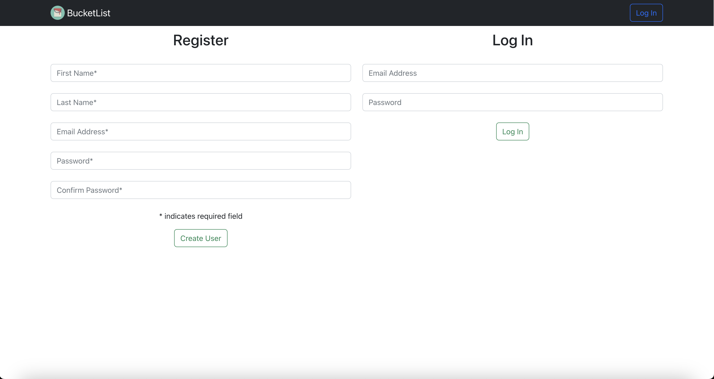
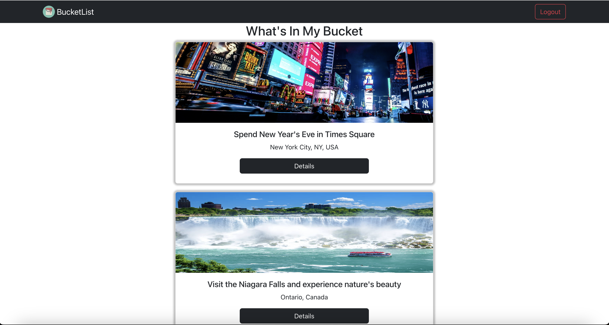
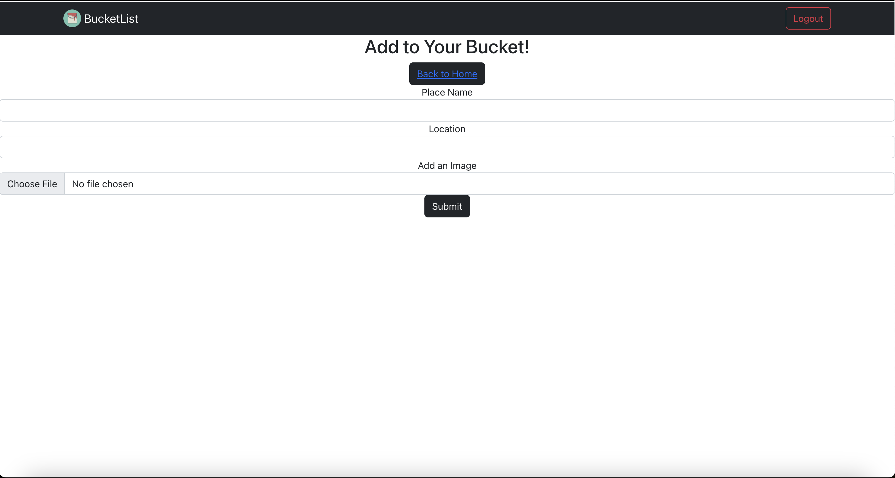
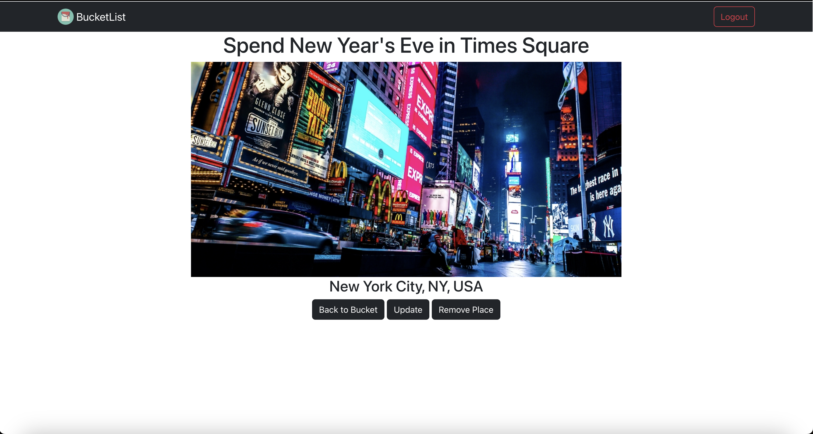

# BucketList
> A full CRUD, full stack web application that provides a canvas for the user to curate their very own bucket list!

## Table of Contents
* [General Info](#general-information)
* [Technologies Used](#technologies-used)
* [Features](#features)
* [Screenshots](#screenshots)
* [Setup](#setup)
* [Usage](#usage)
* [Project Status](#project-status)
* [Room for Improvement](#room-for-improvement)
* [Acknowledgements](#acknowledgements)
* [Contact](#contact)
<!-- * [License](#license) -->

## General Information
- This application is built with the MERN stack. MERN stands for MongoDB, Express, React and NodeJS. These four technologies allow the developer to build applications with the JavaScript programming language on both the front end and the back end. 

## Technologies Used
- Languages: JavaScript
- Frameworks: React, Express, NodeJS
- Styling: Bootstrap
- Databases: MongoDB

## Features
Ready features:
- A login and registration page accessible with an omnipresent navigation bar at the top
- Custom forms and image uploading to truly personalize each item in the user's bucket list
- Detail pages for focusing on one item at a time
- The option to update and delete items as well

## Screen Shots

## Usage
This project is a very personal web application 

## Project Status
Project is fully functional. Future updates include mobile-responsive design and providing the user with the freedom to share bucket list items. 
